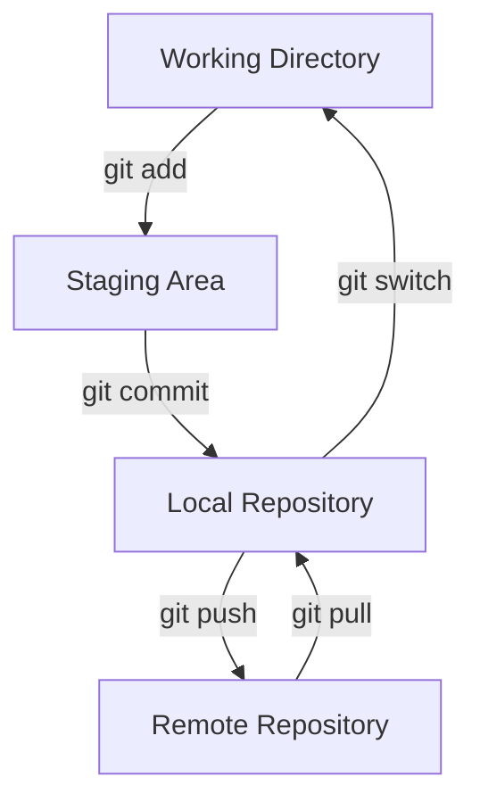

<!-- omit in toc -->
# Git and Github Bootcamp

Collection of notes and exercises for learning how to use Git and Github.

<!-- omit in toc -->
## Table of Contents

- [1. Git Core](#1-git-core)
- [2. Amend, Switching, Branching, and Merging](#2-amend-switching-branching-and-merging)
- [3. Mergin and Resolving Conflicts](#3-mergin-and-resolving-conflicts)
- [4. Comparing Files, Commits, and Branches](#4-comparing-files-commits-and-branches)
- [5. Stashing Changes](#5-stashing-changes)
  - [5.1. Introduction](#51-introduction)
  - [5.2. Stashing Commands](#52-stashing-commands)
- [6. Unmodifying and Unstaging](#6-unmodifying-and-unstaging)
  - [6.1. Working with Staged Changes](#61-working-with-staged-changes)
  - [6.2. Working with Unstaged Changes](#62-working-with-unstaged-changes)
  - [6.3. Working with Both Staged and Unstaged Changes](#63-working-with-both-staged-and-unstaged-changes)
- [7. Examples](#7-examples)
  - [7.1. Merge Branches, Not Commits](#71-merge-branches-not-commits)
- [8. Other Notes](#8-other-notes)
  - [8.1. Working Directory vs. Staging Area](#81-working-directory-vs-staging-area)
  - [8.2. Git Workflow Diagram Explained](#82-git-workflow-diagram-explained)
  - [8.3. Avoid Git Checkout](#83-avoid-git-checkout)
  - [8.4. Important Commands](#84-important-commands)
  - [8.5. Commands for Local Repositories](#85-commands-for-local-repositories)
  - [8.6. Command for Remote Repositories](#86-command-for-remote-repositories)
  - [8.7. Exercise Notes (Git and GitHub)](#87-exercise-notes-git-and-github)
- [9. TODO](#9-todo)

## 1. Git Core

Git is a version control system that tracks and manages changes to files over time. It allows users to review and compare previous file versions, revert changes, and more. For initial setup and configuration of git, refer to the official [git documentation](https://git-scm.com/book/en/v2/Appendix-C%3A-Git-Commands-Setup-and-Config).

One of Git's key concepts is the `HEAD`, a reference to your current location in the repository. It's essentially a pointer to a branch, which in turn is a pointer to a commit. Initially, `HEAD` points to the last commit of the `master` branch, but its position can change as we navigate through the repository.

Let's illustrate this with an example:

1. **First commit:** Both the `master` branch and `HEAD` point to this commit.
2. **Second commit:** The `master` branch and `HEAD` update to point to this new commit.
3. **Create "new-feature" branch:** This branch, now also pointed to by `HEAD`, mirrors the `master` branch's current commit.
4. **Commit in "new-feature":** This new commit updates the `new-feature` branch and `HEAD`, leaving `master` unchanged.
5. **Switch back to master:** `HEAD` updates to point back to the `master` branch, leaving the branch pointers untouched.

We can consider the branch references as "bookmarks" in a book that we can use to jump to a specific page. These bookmarks keep track of different paths in the story. The `HEAD` is the page we are currently reading. At any given time, we're only reading from one page (the `HEAD`), but we can have multiple bookmarks in the book (branches). This way, we can keep track of where we left off in different parts of the story (different lines of development).

Also, it's important to note that we can move to a specific page without using a bookmark (i.e., without using a branch reference) by using the `git switch --detach` (or `git checkout`) command and specifying the commit hash. This is similar to remembering a specific page number and going directly to it. However, without a bookmark, it might be harder to remember where you were, especially if you move to other pages (commits). That's why it's often easier to work with branches: they are like bookmarks that help you keep track of where you've been in the project history.

After branching off from the `master` branch, we can make changes to the code and commit them to the `new-feature` branch. The `master` branch remains unchanged. When we're done with the new feature, we can merge the `new-feature` branch back into the `master` branch. This will combine all the changes made in the `new-feature` branch with the `master` branch since their common ancestor (base) commit.

<!-- adjust link to example -->
It's important to note that we merge branches, not individual commits (see [6.1. Merge Branches, Not Commits](#61-merge-branches-not-commits)) . When we perform a merge operation, Git identifies the common ancestor commit of the two branches and integrates the changes made in both branches since that commit **into** the current `HEAD` branch. If there are conflicting changes, these will need to be resolved manually.

## 2. Amend, Switching, Branching, and Merging

- **Amend the most recent commit**:

   ```shell
   git add <forgotten file>
   git commit --amend -m 'New commit message'
   ```

- **Create a New Branch and Switch to It**

   Creating a new branch and switching to it are often steps performed in sequence when you're starting work on a new feature, bugfix, or experiment. Traditionally, `git checkout` was used for these tasks, but Git has introduced more intuitive, task-specific commands like `git switch` and `git restore` for better clarity and separation of concerns.

   The `git switch` command is more specific to the task of switching branches and makes the action clearer:

   ```shell
   git switch <branch_name>
   ```

   If you want to create a new branch and switch to it in one go, you can do:

   ```shell
   git switch -c <new_branch_name>
   ```

   This is similar to `git checkout -b <new_branch_name>`, but it's clearer in intent.

   Always Stash or Commit Changes Before Switching! Before you switch branches, it's good practice to make sure your working directory is clean. There are two primary ways to do this:

   1. **Committing Changes**: If the changes are complete, and you're ready to save them, commit those to the current branch.

   2. **Stashing Changes**: If your changes are not complete and you're not ready to commit, you can "stash" them. This takes your changes and stores them in a temporary area so that you can reapply them later.

   **Why It's Important**: If you try to switch branches with a dirty working directory, i.e., with uncommitted changes, Git will throw an error if those changes conflict with the branch you're trying to switch to. Even if there's no conflict, carrying uncommitted changes across branches can make for a confusing history and can complicate things like code reviews.

- Delete a branch:

   ```shell
   git branch -d <branch name>
   ```

   Note that you can't delete the branch you're currently on. If you want to delete the current branch, you need to switch to another branch first.

   If the branch you want to delete hasn't been merged yet, you can use the `-D` flag instead of `-d` to force the deletion.

- Rename a branch:

   ```shell
   git branch -m <old_branch> <new_branch>
   ```

- Merge a branch into the current (`HEAD`) branch. Let's assume you want to merge changes from a branch named `feature` into the `main` branch. First, switch to the `main` branch:

   ```shell
   git switch main
   ```

   Next, merge the `feature` branch:

   ```shell
   git merge feature
   ```

   If the `main` branch has not diverged from when `feature` was created (meaning, no other changes were made to `main` after branching/`main` is a direct ancestor of `feature`), Git performs a **fast-forward merge**. In this case, Git simply moves the `HEAD` pointer and `main` branch pointer to the latest commit of `feature`.

   However, if changes were made on `main` after `feature` branched off, Git performs a **three-way merge**. This involves finding the common ancestor of `main` and `feature` and creating a new merge commit that combines changes from each branch. This merge commit has **two parents**: the latest commits of `main` and `feature`. Both `HEAD` and `main` branch pointer then move to this new commit.

   If `main` and `feature` have conflicting changes, you'll need to resolve these manually. Once resolved, create the merge commit by running `git commit`. If you decide to abort the merge, run `git merge --abort` to revert your repository to its state before attempting the merge.

## 3. Mergin and Resolving Conflicts

1. First, start the merge process by switching to the `main` branch:

   ```shell
   git switch main
   git merge feature
   ```
  
  If there are any conflicts, Git will let you know in the command output
  
2. Open the file with conflicts in your text editor. You'll see the conflicting changes marked in the following way:

   ```shell
   <<<<<<< HEAD
   [Changes made on the current branch]
   =======
   [Changes made on the other branch]
   >>>>>>> feature
   ```

   Everything between `<<<<<<< HEAD` and `=======` represents the changes on the current branch (`main` in our case). And everything between `=======` and `>>>>>>> feature` are the changes on the `feature` branch.

3. To resolve the conflict, you need to decide if you want to keep the changes from the `main` branch, the `feature` branch, or a combination of both. Edit the file to make it look like the way you want the final code to be. Delete the conflict markers `<<<<<<<`, `=======`, and `>>>>>>>` when you're done editing.

4. After resolving the conflict in a file, you need to add it to the staging area:

   ```shell
   git add <filename>
   ```

5. Repeat the process for all files with conflicts.
  
6. Once you've resolved all conflicts and staged the changes, commit the merge:

   ```shell
   git commit -m "Resolved merge conflicts for merging feature into main"
   ```

Remember, resolving conflicts can sometimes be tricky if the same part of the code has been significantly changed in both branches. It might be necessary to consult with the author of the changes or to understand the context of each change to make an informed decision.

For complex projects with multiple contributors, it's good practice to communicate openly about conflicts and to resolve them collaboratively.

Note that after merging you can delete all branches that are no longer needed. For example, if you've merged the `feature` branch into `main`, you can delete the `feature` branch:

```shell
git branch -d feature
```

Or multiple branches at once:

```shell
git branch -d feature1 feature2 feature3
```

Or all branches but main with one of the following commands:

```shell
git branch -d $(git branch | grep -v main)
# or git branch | grep -v main | xargs git branch -d
```

## 4. Comparing Files, Commits, and Branches

Note that in the documentation, the **stagging area** is also called **index**.

- **Working Directory vs. Staging Area** (only unstaged changes)

   ```shell
   git diff
   ```

    This command highlights what has been changed but is not yet staged for the next commit. Note that you can compare individual files by specifying the file name, i.e., `git diff <filename>`.

- **Staged File vs. Last Commit (`HEAD`)** (only staged changes)

   ```shell
   git diff --staged
   # or git diff --cached
   ```

- **Working Directory (and Staging Area) vs. Last Commit (`HEAD`)** (both staged and unstaged changes)

   ```shell
   git diff HEAD
   ```

   This command will show both staged and unstaged changes combined, as they would look if you committed them right now.

- Compare Branches, Commits, or Files in Different Commits

   ```shell
   git diff <branch1> <branch2>
   git diff <commit1> <commit2>
   git diff <commit1>:<file1> <commit2>:<file1>
   # or git diff <commit1> <commit2> <file1>
   ```

## 5. Stashing Changes

### 5.1. Introduction

Stashing is a way to temporarily store both staged and unstaged changes that you don't want to commit immediately. This is particularly useful when you need to quickly switch context and work on a different branch, but you're in the middle of making code changes that aren't ready to be committed.

1. **Changes Come With You**: If you switch branches without stashing, your changes (both staged and unstaged) will come with you to the new branch, as long as they don't conflict with files in the destination branch. This is the default behavior of Git and works well for quick context switches, assuming no conflicts.
2. **Potential Conflicts**: Git will prevent you from switching branches if it detects that the changes you have (staged or unstaged) would conflict with the destination branch. This is where git stash becomes particularly useful. You can stash your changes, switch branches, and then later apply the stash to continue where you left off.

So, stashing is a way to sidestep both of these issues: it allows you to cleanly switch branches without committing unfinished work, and it eliminates the issue of conflicts when switching branches.

When you stash your changes, it results in a "clean working tree." A **clean working tree** means that there are no changes that are staged (in the staging area) or unstaged (in the working directory). Having a clean working tree is often necessary for various Git operations, like pulling from a remote repository or switching to a different branch that has conflicting changes.

### 5.2. Stashing Commands

- **Stash Changes**: This command takes all uncommitted changes (both staged and unstaged) and stores them in a temporary area, leaving you with a clean working tree.

   ```shell
   git stash
   ```

   By default, git stash will stash both staged and unstaged changes. If you want more control over what to stash, you can use the following flags:
  - --keep-index: Stash only unstaged changes and keep staged changes in the staging area.
  - --include-untracked: Stash both staged and unstaged changes, as well as any untracked files.
  - --all: Stash all changes, including ignored files.

- **List Stashes**: This command lists all stashes in the order they were created. The most recent stash is at the top.

   ```shell
   git stash list
   ```

- **Apply or Pop Stash**: The apply command reapplies the most recent stash to your working directory without removing it from the stash list. On the other hand, pop both reapplies and removes the most recent stash from the stash list.

   ```shell
   git stash apply
   # or
   git stash pop
   ```

   If you want to apply or pop a specific stash, you can specify its index like so:

   ```shell
   git stash apply stash@{<stash_number>}
   # or
   git stash pop stash@{<stash_number>}
   ```

- **Drop a Specific Stash or Clear All Stashes**: The drop command deletes a specified stash from the stash list. The clear command removes all stashes from the stash list.

   ```shell
   git stash drop stash@{<stash_number>}
   # or
   git stash clear
   ```

<!-- continuehere -->
## 6. Unmodifying and Unstaging

### 6.1. Working with Staged Changes

- **Unstage Changes**: If you've staged changes with `git add` and want to unstage those changes, use:

    ```shell
    git restore --staged <filename>
    ```

    This command will unstage the changes while leaving the file in your working directory as it is, preserving any changes you've made.

### 6.2. Working with Unstaged Changes

- **Remove Unstaged Changes and Match the Staged or Last Committed Version**: If you've made changes to a file but haven't staged them, and you want to undo these changes, you can:

    ```shell
    git restore <filename>
    ```
  
    This will remove any unstaged changes and make the file in your working directory match the staged version, which could be either the last committed version or a previously staged but uncommitted change.

### 6.3. Working with Both Staged and Unstaged Changes

- **Remove Both Unstaged and Staged Changes and Restore to Last Committed Version**: If you want to discard all changes (both staged and unstaged) and restore the file to its last committed version, use:

    ```shell
    git restore --source=HEAD <filename>
    ```

    This explicitly tells Git to restore the file to the last committed state based on `HEAD`, ignoring both staged and unstaged changes.

- **Restore File to a Specific Past Commit**: To restore a file to the state from a specific past commit, use:

    ```shell
    git restore --source=<commit_hash> <filename>
    ```

    This will restore the file to the state it was in at the specified commit, discarding all changes made to the file since then.

## 7. Examples

### 7.1. Merge Branches, Not Commits

Imagine you have a repository with the following history (newest commits at the top):

```sql
* commit D (HEAD -> feature)
* commit C
* commit B (main)
* commit A
```

**Step 1: Switch to the Branch You Want to Merge Into**

First, you'll typically check out to the branch you want to merge the changes into (often this is `main` or `master`).

```shell
git switch main
```

Your `HEAD` is now pointing at `main`, specifically commit `B`.

**Step 2: Perform Merge**

Next, you merge the `feature` branch into `main`.

```shell
git merge feature
```

**What Happens During Merge**

1. **Identify Common Ancestor**: Git identifies the common ancestor of the two branches, which is commit `B` in this case.
2. **Integrate Changes**: Git then looks at commits `C` and `D` on the `feature` branch that occurred after the common ancestor `B`, and applies those changes on top of commit `B` in `main`.
3. **New Merge Commit**: Usually, a new "merge commit" is created to mark the point where the two branches were merged. This commit will have two parent commits: the previous tip of the `main` branch (commit `B`) and the tip of the `feature` branch (commit `D`).

Your history would look something like this if the merge is successful:

```sql
* commit E (HEAD -> main, Merge commit)
|\  
| * commit D (feature)
| * commit C
* | commit B
|/
* commit A
```

- `main` is now at commit `E`, which integrated the changes from the `feature` branch.
- `feature` branch still points to commit `D`.

**Step 3: Handling Conflicts**

If changes in `feature` conflict with changes in `main` since the common ancestor ( `B`), Git will prompt you to resolve these conflicts manually. Once resolved, you can proceed to create the merge commit.

So when the statement says "we merge branches, not individual commits," it means the operation takes into account the series of commits that have occurred on the branches since their common ancestor. The merge operation attempts to integrate all of these changes into the `HEAD` branch ( `main` in this example).

## 8. Other Notes

### 8.1. Working Directory vs. Staging Area

The term "working directory" refers to the *set of files and directories* in your local file system that is associated with a Git repository. These files represent the current state of your project and may include changes that are either staged or unstaged.

Here's a breakdown to help conceptualize:

- **Staged Changes**: These are changes that have been marked for inclusion in the next commit. Staging changes doesn't affect your working directory; it affects the staging area, which is a layer between the working directory and the repository.
- **Unstaged Changes**: These are changes in your working directory that have not yet been staged. These could be modifications to existing files or new files that haven't been added to the staging area yet.
- **Clean Working Directory**: This means that there are no changes in either staged or unstaged state. The working directory matches the latest commit in the current branch.

To conceptualize, consider your working directory as your "workspace" where you do your regular work—creating, editing, deleting files, etc. The staging area is like a "preparation area," a place where you gather all the changes that you want to commit. Finally, the Git repository itself is the "record book" or "database" that keeps a history of all the commits (sets of changes) made over time.

In summary, the working directory contains both staged and unstaged changes, but it's helpful to think of the staged changes as being in a separate "staging area," awaiting to be committed to the repository.

### 8.2. Git Workflow Diagram Explained



The above diagram illustrates the key areas of a Git workflow:

1. **Working Directory**: This is where your actual files live. When you make changes to your files, those changes are initially unstaged and exist only in your working directory.

    - **Transition to Staging Area**: You stage these changes by running `git add`, which moves the changes to the staging area.

2. **Staging Area**: This is an intermediate area where changes are collected before being permanently stored in the commit history of the local repository.

    - **Transition to Local Repository**: After staging, you run `git commit` to store the changes from the staging area into the local repository.

3. **Local Repository**: This is the `.git` folder in your project directory. It contains the entire history of your project.

    - **Transition to Remote Repository**: You can push commits from your local repository to a remote repository using `git push`.
  
    - **Transition to Working Directory**: You can update the working directory to reflect a specific commit or branch using `git switch`.

4. **Remote Repository**: This is a version of your project that is hosted on a remote server, typically platforms like GitHub, GitLab, or Bitbucket.

    - **Transition to Local Repository**: You can update your local repository to match the remote repository by running `git pull`, which fetches changes from the remote and merges them into your local repository.

### 8.3. Avoid Git Checkout

Avoiding git checkout in favor of more specialized commands is a good idea for clarity and specificity.

1. **Switching branches**: Use `git switch <branch_name>` instead of `git checkout <branch_name>`.

    ```bash
    git switch feature-branch
    ```

2. **Creating a new branch and switching to it**: Use `git switch -c <new_branch_name>` instead of `git checkout -b <new_branch_name>`.

    ```bash
    git switch -c new-feature-branch
    ```

3. **Restore a file to the last committed state**: Use `git restore <file>` instead of `git checkout -- <file>`.

    ```bash
    git restore some-file.txt
    ```

4. **Unstaging changes**: Use `git restore --staged <file>` instead of `git checkout HEAD -- <file>` to unstage changes.

    ```bash
    git restore --staged some-file.txt
    ```

5. **Applying changes from another branch**: Use `git apply` or `git cherry-pick` to bring in changes from another branch without switching to it. `git checkout` used to do this with the `-p` flag, but it's not the primary way to do it anymore.

6. **Detaching HEAD**: While `git checkout` could be used to detach the HEAD, you can do it explicitly using `git switch` and `git reset`:

    ```bash
    git switch --detach
    git reset --hard <commit_hash>
    ```

7. **Checking out submodules**: If you are working with submodules, instead of `git checkout` you might use a combination of `git submodule update` and other submodule commands.

### 8.4. Important Commands

- `git init`: initialize a git repository in the current directory
- `git add <file>`: add a file to the staging area
- `git commit`: commit the staged files
- `git status`: see the status of the current repository
- `git merge <branch>`: merge the specified branch into the current branch
- `git switch <branch>`: switch to the specified branch and update the working directory
- `git switch -c <branch>`: create and switch to a new branch
- `git branch`: list all the branches in the current repository
- `git branch -d <branch>`: delete a branch`

### 8.5. Commands for Local Repositories

- `git log`: see the commit history
- `git diff`: see the changes between commits, branches, etc.
- `git branch <BRANCH_NAME>`: create a branch
- `git branch -d <BRANCH_NAME>`: delete a branch
- `git merge <BRANCH_NAME>`: merge a branch into the current branch

### 8.6. Command for Remote Repositories

- `git remote add <REMOTE_NAME> <REMOTE_URL>`: add a remote repository
- `git push <REMOTE_NAME> <BRANCH_NAME>`: push a branch to a remote repository
- `git pull <REMOTE_NAME> <BRANCH_NAME>`: pull a branch from a remote repository
- `git clone <REMOTE_URL>`: clone a remote repository
- `git fetch <REMOTE_NAME>`: fetch a remote repository
- `git reset`: reset the staging area
- `git revert`: revert a commit
- `git stash`: stash changes
- `git stash pop`: pop the most recent stash
- `git stash list`: list all stashesexit
- `git stash clear`: clear all stashes
- `git config --global alias.<ALIAS_NAME> <COMMAND>`: create a custom alias
- `git rebase <BRANCH_NAME>`: rebase a branch onto the current branch
- `git tag <TAG_NAME>`: create a tag
- `git tag -d <TAG_NAME>`: delete a tag
- `git reflog`: see the reflog
- `git reflog delete`: delete the reflog
- `git reflog expire --expire-unreachable=now --all`: delete the reflog
- `git reflog expire --expire=now --all`: delete the reflog

### 8.7. Exercise Notes (Git and GitHub)

Once your pull request has been approved and merged into the main branch, you typically don't need the pull request branch anymore. You can delete it to keep your repository tidy. However, depending on your team's workflow and policies, you might want to keep the branch for a while for reference or in case additional changes or fixes are needed.

If you choose to delete the branch, you can do so both locally and on the remote:

1. Delete the branch locally:

   ```shell
   git branch -d <branch-name>
   ```

   If the branch hasn't been merged and you still want to delete it, you can force the deletion:

   ```shell
   git branch -D <branch-name>
   ```

2. Delete the branch on the remote:

   ```shell
   git push origin --delete <branch-name>
   ```

   Before you delete the branch, switch back to the main branch (usually `master` or `main`) or another branch:

   ```shell
   git switch <main-branch-name>
   ```

   Also, update your local main branch with the latest changes:

   ```shell
   git pull origin <main-branch-name>
   ```

Deleting a branch doesn't delete the commits on that branch, it simply removes the branch pointer. The commits are still in the Git repository and can be accessed directly via their commit hashes.

You can use `git switch` followed by a commit hash to move the `HEAD` to a specific commit:

```shell
git switch <commit-hash>
```

Doing so will put you in a "detached HEAD" state, where you're not on any branch. Any new commits you make in this state won't be associated with any branch and will be lost once you switch back to a normal branch, unless you create a new branch while you're in the detached HEAD state:

```shell
git switch -c <new-branch-name>
```

Please note that commits not reachable by any branch or tag may be deleted by Git's garbage collection process. If you want to keep these commits, you should create a new branch to point to them.

## 9. TODO

- Remove the title format from the lists in section 4 and 5
